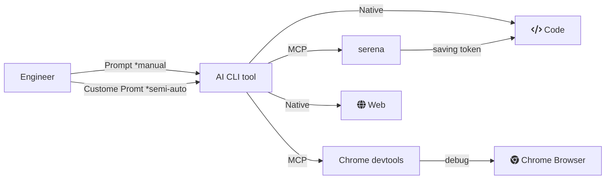

## コンセプト

コンセプトは開発のボトルネックから人間が外れていく。
- 必要なもの：コンテキスト。サイロ化している。wikiとGoogleDrive
- AIツールにアクセスを許可
  - ソースファイル
  - サーバーで何がおきているか：docker logs, rails console
  - エラーチェック：rubocop, typecheck
  - 成果物の保存：commit
- ブラウザの状態を見せる：playwrght, chrome devtools
- トークン消費の節約：serena



## Codex自体の設定

### タスク終了したら音を鳴らす

```~/.codex/config.toml
notify = ["bash", "-lc", "afplay /System/Library/Sounds/Frog.aiff"]
```

普段使わない音がいいよね。ピチョンって音にした。
通知音の大きさはMacの方で調整。


### Web検索の有効化

デフォルト無効になっている。OpenAPIとか参照してほしいから有効にする。
参考記事から仕様が変わっていて、記事作成時点では下記が正しい。

```~/.codex/config.toml
[features]
web_search_request = true
```

## MCP Asana

```~/.codex/config.toml
[mcp_servers.asana]
command = "npx"
args = ["mcp-remote", "https://mcp.asana.com/sse"]

[mcp_servers.asana.env]
ASANA_ACCESS_TOKEN = "YOUR_ACCESS_TOKEN"
```

ログインできないときにCodexにきくとタイムアウトのばせといわれたが、伸ばしても解決しなかった。
ログインできないっていうときはトークンつかってアクセスしろ、でいけたのでとりあえずトークンつけている。
トークン消したい。


## MCP Serena

### まずはSerenaを使えるようにする
```zsh
% brew install uv

## 一回自前で起動しておかないとうごかない
% uvx --from git+https://github.com/oraios/serena serena start-mcp-server --context codex
```

### Codex CLI に Serenaを追加
```zsh
% codex mcp add serena -- uvx --from git+https://github.com/oraios/serena serena start-mcp-server --context codex
```

### Cdexでプロジェクトをアクティブ化

```zsh
% codex

/mcp

# プロジェクトをアクティブ化するプロンプト
Activate the current dir as project using serena
```

### 便利。MCPでSerena使うときに毎回Serenaのローカルサーバーのページがうざい対策

```zsh
% codex mcp remove serena

% codex mcp add serena -- \
uvx --from git+https://github.com/oraios/serena \
serena start-mcp-server --context codex --enable-web-dashboard=false
```


## MCP Chrome devtools

```zsh
codex mcp add chrome-devtools -- npx chrome-devtools-mcp@latest
```
プロンプトでブラウザでlocalhostのページで確認する指示したらブラウザが起動した。
びっくらぽん。
Playwright入れようと思ってたけど、Chromeだけで事足りてるので使ってみる。
あんまりPlaywrightと機能差異はなさそうだけど、パフォーマンスが見れそう。
[Chrome DevTools MCPでWeb開発のチェックを自動化！Playwright MCPとの違いは？ #ClaudeCode - Qiita](https://qiita.com/tomada/items/8b22cac69b5247df1c20)

PlaywrightはE2Eテスト作るときに重宝するかもしれんが、それはおいおい。


## 参考
- [Codex CLIを使いこなすための機能・設定まとめ](https://zenn.dev/dely_jp/articles/codex-cli-matome)
- [技術調査 - Serena MCP](https://zenn.dev/suwash/articles/serene_mcp_20250807)

