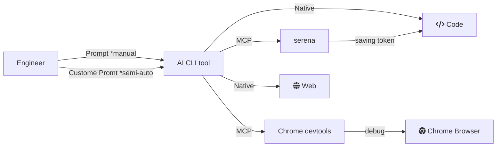

## コンセプト

コンセプトは開発のボトルネックから人間が外れていく。
- 必要なもの：コンテキスト。サイロ化している。wikiとGoogleDrive
- AIツールにアクセスを許可
  - ソースファイル
  - サーバーで何がおきているか：docker logs, rails console
  - エラーチェック：rubocop, typecheck
  - 成果物の保存：commit
- ブラウザの状態を見せる：playwrght, chrome devtools
- トークン消費の節約：serena



## Codex自体の設定

### タスク終了したら音を鳴らす

```~/.codex/config.toml
notify = ["bash", "-lc", "afplay /System/Library/Sounds/Frog.aiff"]
```

普段使わない音がいいので、ピチョンって音にしました。
通知音の大きさはMacの方で調整。


### Web検索の有効化(Update: 2026-02-06)

~~デフォルト無効になっている。OpenAPIとか参照してほしいから有効にする。~~
~~参考記事から仕様が変わっていて、記事作成時点では下記が正しい。~~
デフォルトで有効になったので有効にしたいときは特段設定しなくてよさそう。
（cachedがデフォルト）
逆に無効にするには指定しないといけなくなった。
[Codex changelog 2026-01-28](https://developers.openai.com/codex/changelog/#codex-2026-01-28-mdx)

```~/.codex/config.toml
# [features]
# web_search_request = true
```

## MCP Asana

```~/.codex/config.toml
[mcp_servers.asana]
command = "npx"
args = ["mcp-remote", "https://mcp.asana.com/sse"]

[mcp_servers.asana.env]
ASANA_ACCESS_TOKEN = "YOUR_ACCESS_TOKEN"
```

ログインできないときにCodexにきくとタイムアウトのばせといわれたが、伸ばしても解決しなかった。
ログインできないっていうときはトークンつかってアクセスしろ、でいけたのでとりあえずトークンつけている。
~~トークン消したい。~~
トークン消してもブラウザで認証求めてきたのでトークン消せました。


## MCP Serena

### まずはSerenaを使えるようにする

```zsh
% brew install uv

## 一回自前で起動しておかないとうごかない
% uvx --from git+https://github.com/oraios/serena serena start-mcp-server --context codex
```

### Codex CLI に Serenaを追加
```zsh
% codex mcp add serena -- uvx --from git+https://github.com/oraios/serena serena start-mcp-server --context codex
```

### Cdexでプロジェクトをアクティブ化

```zsh
% codex

/mcp

# プロジェクトをアクティブ化するプロンプト
Activate the current dir as project using serena
```

### 便利。MCPでSerena使うときに毎回Serenaのローカルサーバーのページがうざい対策

```zsh
% codex mcp remove serena

% codex mcp add serena -- \
uvx --from git+https://github.com/oraios/serena \
serena start-mcp-server --context codex --enable-web-dashboard=false

## (2026-02-06 Updated)ときどきタイムアウトするので設定でタイムアウト10秒つけておく
```


## MCP Chrome devtools

```zsh
codex mcp add chrome-devtools -- npx chrome-devtools-mcp@latest
```
プロンプトでブラウザでlocalhostのページで確認する指示したらブラウザが起動した。
びっくらぽん。
Playwright入れようと思ってたけど、Chromeだけで事足りてるので使ってみる。
あんまりPlaywrightと機能差異はなさそうだけど、パフォーマンスが見れそう。
[Chrome DevTools MCPでWeb開発のチェックを自動化！Playwright MCPとの違いは？ #ClaudeCode - Qiita](https://qiita.com/tomada/items/8b22cac69b5247df1c20)

PlaywrightはE2Eテスト作るときに重宝するかもしれんが、それはおいおい。

## MCP BugSnag(SmartBear MCP)
GitHubでBugSnagのMCPサーバーがヒットしたが個人のものなので注意。
SmartBearからMCPサーバーが公開されているのでそれを使いましょう。
(公式にリファレンスありましたが、取得方法に言及してないのがイマイチ・・・)

```
# sample
% codex mcp add smartbear \
    --env BUGSNAG_AUTH_TOKEN=VALUE1 \
    --env BUGSNAG_PROJECT_API_KEY=VALUE2 \
    -- npx -y @smartbear/mcp@latest

# Codex CLIに追加
% codex mcp add smartbear \
    --env BUGSNAG_AUTH_TOKEN=MY_TOKEN \
    -- npx -y @smartbear/mcp@latest

(codex cli) BugSnagからプロジェクト取得
=> 取得できないと言われた。トークンを見直したが問題なかった

# MCPサーバーを検証
% npx -y @wong2/mcp-cli -c /tmp/mcp.json call-tool smartbear:bugsnag_list_projects --args '{}'
=> JSONレスポンス取れたので大丈夫そう

(codex cli) BugSnagからプロジェクト取得
• Called smartbear.bugsnag_list_projects({})
=> プロンプトかえってきた
```


## 参考
- [Codex CLIを使いこなすための機能・設定まとめ](https://zenn.dev/dely_jp/articles/codex-cli-matome)
- [技術調査 - Serena MCP](https://zenn.dev/suwash/articles/serene_mcp_20250807)
- [Codex changelog 2026-01-28](https://developers.openai.com/codex/changelog/#codex-2026-01-28-mdx)
- [BugSnag Integration | SmartBear MCP Server | SmartBear](https://developer.smartbear.com/smartbear-mcp/docs/bugsnag-integration)
- [SmartBear/smartbear-mcp: SmartBear's official MCP Server](https://github.com/SmartBear/smartbear-mcp)

